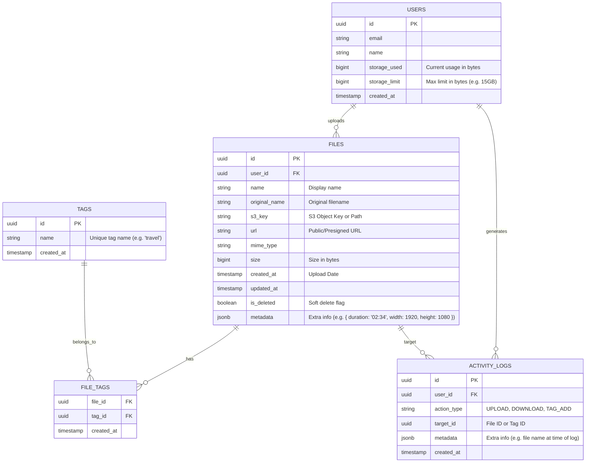

# Database Schema Design

Based on the frontend requirements and data structure, here is the proposed Database Schema. This is designed for a relational database (e.g., PostgreSQL, MySQL).

## ER Diagram



## Table Details

### 1. Users (`users`)
Stores user account information and storage quotas.
- **id**: Primary Key.
- **storage_used**: Updated via triggers or application logic when files are uploaded/deleted.
- **storage_limit**: Default 15GB (16,106,127,360 bytes).

### 2. Files (`files`)
Stores metadata for uploaded files. The actual file content should be stored in an Object Storage (like AWS S3, Google Cloud Storage).
- **s3_key**: The reference to the file in object storage.
- **url**: Can be a permanent URL or generated presigned URL.
- **is_deleted**: For "Trash" functionality or soft deletes.
- **metadata**: JSONB column to store file-specific details like video duration, image resolution, etc.

### 3. Tags (`tags`)
Stores unique tag names.
- **name**: Normalized (e.g., lowercase) to ensure consistency.

### 4. File Tags (`file_tags`)
Junction table for Many-to-Many relationship between Files and Tags.

### 5. Activity Logs (`activity_logs`)
Tracks user actions to generate the "Activity History" on MyPage.
- **action_type**:
  - `UPLOAD`: Logged when a file is uploaded.
  - `DOWNLOAD`: Logged when a file is downloaded.
  - `TAG_ADD`: Logged when a tag is created/added.
- **Querying for Calendar**:
  - **Uploads**: Count `ACTIVITY_LOGS` where `action_type = 'UPLOAD'` AND `date(created_at) = :date`.
  - **Downloads**: Count `ACTIVITY_LOGS` where `action_type = 'DOWNLOAD'` AND `date(created_at) = :date`.
  - **Tags**: Join `ACTIVITY_LOGS` with `TAGS` (if target_id is tag_id) or `FILE_TAGS` to get tags used on that date.

## SQL Queries for Frontend Requirements

### Gallery List (with Filtering)
```sql
SELECT f.* 
FROM files f
JOIN file_tags ft ON f.id = ft.file_id
JOIN tags t ON ft.tag_id = t.id
WHERE f.user_id = :userId
  AND f.is_deleted = false
  AND (:search IS NULL OR f.name LIKE :search OR t.name LIKE :search)
  AND (:date IS NULL OR DATE(f.created_at) = :date)
ORDER BY f.created_at DESC;
```

### MyPage Stats (Storage)
```sql
SELECT storage_used, storage_limit 
FROM users 
WHERE id = :userId;
```

### MyPage Activity (Daily Stats)
```sql
SELECT 
    DATE(created_at) as activity_date,
    COUNT(CASE WHEN action_type = 'UPLOAD' THEN 1 END) as upload_count,
    COUNT(CASE WHEN action_type = 'DOWNLOAD' THEN 1 END) as download_count
FROM activity_logs
WHERE user_id = :userId 
  AND created_at >= :startDate AND created_at <= :endDate
GROUP BY DATE(created_at);
```
