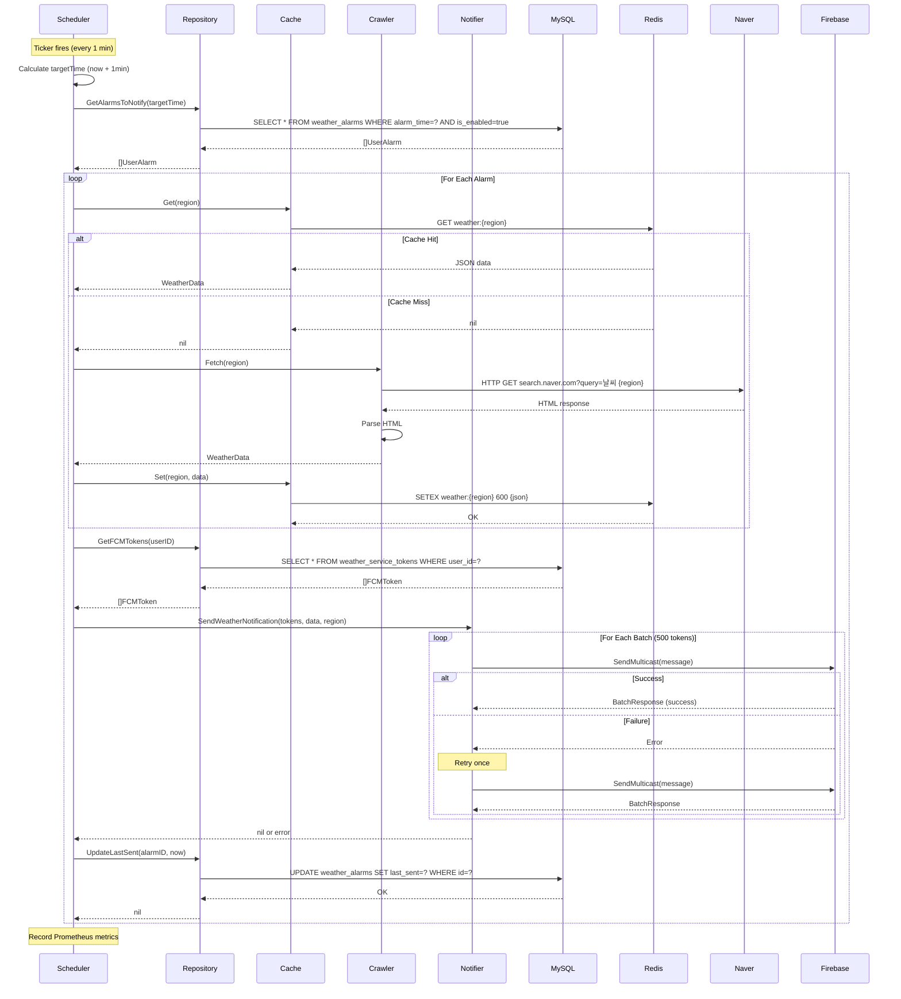
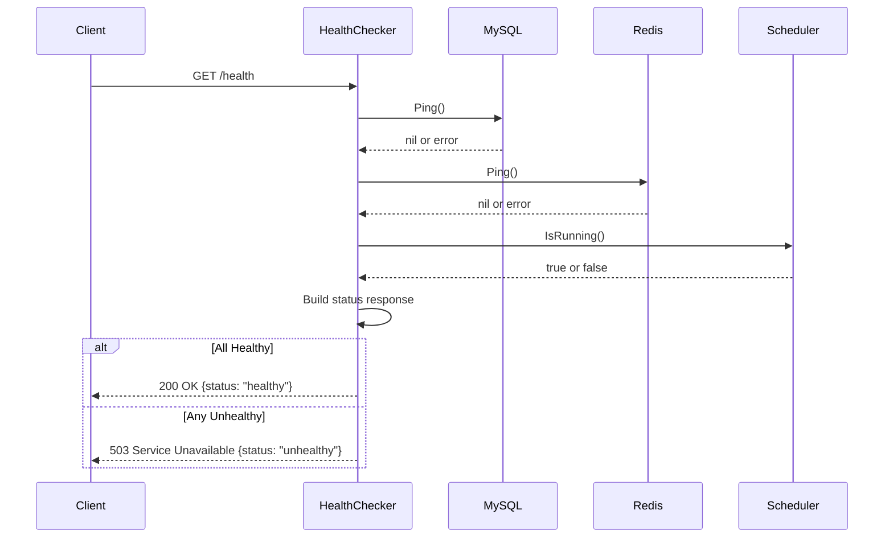

# Architecture Documentation

Comprehensive architecture overview of the Weather Data Collector Service.

**Version:** 1.0.0
**Last Updated:** 2025-11-11

## Table of Contents

- [System Overview](#system-overview)
- [Component Architecture](#component-architecture)
- [Data Flow](#data-flow)
- [Sequence Diagrams](#sequence-diagrams)
- [Deployment Architecture](#deployment-architecture)
- [Technology Stack](#technology-stack)
- [Design Decisions](#design-decisions)

## System Overview

The Weather Data Collector Service is a scheduled notification system built on a microservices architecture with clear separation of concerns.

### High-Level Architecture

```
┌─────────────────────────────────────────────────────────────┐
│                    Weather Scheduler Service                 │
│                                                              │
│  ┌──────────────┐  ┌──────────────┐  ┌──────────────┐     │
│  │   Scheduler  │  │   Metrics    │  │    Health    │     │
│  │   (1-min)    │  │   (HTTP)     │  │   (HTTP)     │     │
│  └──────┬───────┘  └──────────────┘  └──────────────┘     │
│         │                                                   │
│  ┌──────▼─────────────────────────────────────────┐       │
│  │         Alarm Processing Pipeline              │       │
│  │                                                 │       │
│  │  Repository → Cache → Crawler → Notifier       │       │
│  └─────────────────────────────────────────────────┘       │
│                                                              │
└─────────────────────────────────────────────────────────────┘
         │              │              │              │
         ▼              ▼              ▼              ▼
    ┌────────┐    ┌────────┐    ┌────────┐    ┌────────┐
    │ MySQL  │    │ Redis  │    │ Naver  │    │  FCM   │
    │ (Data) │    │(Cache) │    │Weather │    │(Push)  │
    └────────┘    └────────┘    └────────┘    └────────┘
```

### Design Principles

1. **Separation of Concerns**: Each component has single responsibility
2. **Dependency Inversion**: Depend on interfaces, not implementations
3. **Fail Fast**: Validate configuration early, fail explicitly
4. **Graceful Degradation**: Continue operation when optional services fail
5. **Observability**: Comprehensive logging, metrics, health checks

## Component Architecture

### Component Diagram

```
┌───────────────────────────────────────────────────────────────┐
│                      Scheduler Service                         │
├───────────────────────────────────────────────────────────────┤
│                                                                │
│  ┌──────────────────────────────────────────────────────┐    │
│  │             WeatherSchedulerService                   │    │
│  │  - Start()                                            │    │
│  │  - Stop()                                             │    │
│  │  - processAlarms()                                    │    │
│  └────┬────────────────┬──────────────┬─────────────┬───┘    │
│       │                │              │             │         │
│  ┌────▼─────┐    ┌────▼────┐    ┌───▼────┐   ┌────▼────┐   │
│  │Repository│    │ Cache   │    │Crawler │   │Notifier │   │
│  │Interface │    │Interface│    │Interface│   │Interface│   │
│  └────┬─────┘    └────┬────┘    └───┬────┘   └────┬────┘   │
│       │               │              │             │         │
└───────┼───────────────┼──────────────┼─────────────┼─────────┘
        │               │              │             │
        │               │              │             │
┌───────▼─────┐  ┌─────▼──────┐  ┌───▼─────┐  ┌───▼──────┐
│Scheduler    │  │ Weather    │  │  Naver  │  │   FCM    │
│Weather      │  │  Cache     │  │ Weather │  │ Notifier │
│Repository   │  │  (Redis)   │  │ Crawler │  │          │
└──────┬──────┘  └─────┬──────┘  └────┬────┘  └────┬─────┘
       │               │              │            │
       ▼               ▼              ▼            ▼
   ┌────────┐     ┌────────┐    ┌────────┐   ┌────────┐
   │ MySQL  │     │ Redis  │    │ HTTP   │   │Firebase│
   │   DB   │     │Server  │    │Client  │   │  SDK   │
   └────────┘     └────────┘    └────────┘   └────────┘
```

### Component Responsibilities

#### Scheduler

**Location:** `features/weather/scheduler/`

**Responsibilities:**
- Manage 1-minute ticker for alarm processing
- Coordinate alarm pipeline (repository → cache → crawler → notifier)
- Handle graceful shutdown with timeout
- Track in-flight operations with WaitGroup

**Key Methods:**
- `Start(ctx)`: Begin scheduler loop with ticker
- `Stop()`: Graceful shutdown with 30s timeout
- `processAlarms(ctx, targetTime)`: Process alarms for target time
- `processAlarm(ctx, alarm)`: Handle single alarm notification

**Dependencies:**
- ISchedulerWeatherRepository
- IWeatherCache
- IWeatherCrawler
- IFCMNotifier

---

#### Repository

**Location:** `features/weather/repository/`

**Responsibilities:**
- Database access for alarms and FCM tokens
- Query optimization with prepared statements
- Connection pool management
- Transaction handling

**Key Methods:**
- `GetAlarmsToNotify(ctx, time)`: Fetch alarms for target time
- `UpdateLastSent(ctx, alarmID, time)`: Mark alarm as sent
- `GetFCMTokens(ctx, userID)`: Retrieve user's FCM tokens

**Database Tables:**
- `weather_alarms`: User alarm configurations
- `weather_service_tokens`: FCM registration tokens

---

#### Cache

**Location:** `features/weather/cache/`

**Responsibilities:**
- Redis-based weather data caching
- JSON serialization/deserialization
- TTL management (10 minutes)
- Connection pooling

**Key Methods:**
- `Get(ctx, region)`: Retrieve cached weather data
- `Set(ctx, region, data)`: Store weather data with TTL
- `Delete(ctx, region)`: Invalidate cache entry
- `Ping(ctx)`: Health check

**Cache Strategy:**
- **TTL:** 10 minutes (balance freshness vs. API calls)
- **Eviction:** LRU (Least Recently Used)
- **Key Format:** `weather:{region}`
- **Serialization:** JSON

---

#### Crawler

**Location:** `features/weather/crawler/`

**Responsibilities:**
- Fetch real-time weather from Naver Weather
- HTML parsing with goquery
- Retry logic with exponential backoff
- Error handling and logging

**Key Methods:**
- `Fetch(ctx, region)`: Fetch weather data with retries

**Retry Strategy:**
- **Max Retries:** 3
- **Backoff:** Exponential (1s, 2s, 4s)
- **Timeout:** 10 seconds per attempt

**Parsing Logic:**
- Temperature: `.temperature_text strong`
- Humidity: `.info_list .sort` (label: "습도")
- Precipitation: `.info_list .sort` (label: "강수")
- Wind Speed: `.info_list .sort` (label: "바람")

---

#### Notifier

**Location:** `features/weather/notifier/`

**Responsibilities:**
- Send FCM notifications via Firebase SDK
- Batch processing (500 tokens per batch)
- Retry failed batches
- Individual failure logging

**Key Methods:**
- `SendWeatherNotification(ctx, tokens, data, region)`: Send notifications

**Batch Strategy:**
- **Batch Size:** 500 (FCM limit)
- **Retry:** 1 attempt per batch
- **Success Criteria:** Any token succeeds
- **Error Handling:** Log individual failures, return error only if all fail

---

## Data Flow

### Alarm Processing Flow

```
1. Scheduler Tick (Every 1 minute)
   │
   ├─▶ Calculate Target Time (current + 1 minute)
   │
   └─▶ Process Alarms
       │
       ├─▶ GetAlarmsToNotify(targetTime)
       │   └─▶ MySQL Query
       │       SELECT * FROM weather_alarms
       │       WHERE alarm_time = '09:00'
       │         AND is_enabled = true
       │         AND (last_sent IS NULL OR DATE(last_sent) != CURDATE())
       │
       ├─▶ For Each Alarm:
       │   │
       │   ├─▶ Get Weather Data
       │   │   ├─▶ Cache.Get(region)
       │   │   │   └─▶ Redis GET weather:{region}
       │   │   │
       │   │   └─▶ If Cache Miss:
       │   │       └─▶ Crawler.Fetch(region)
       │   │           ├─▶ HTTP GET https://search.naver.com/...
       │   │           ├─▶ Parse HTML
       │   │           └─▶ Cache.Set(region, data)
       │   │               └─▶ Redis SETEX weather:{region} 600 {json}
       │   │
       │   ├─▶ Get FCM Tokens
       │   │   └─▶ Repository.GetFCMTokens(userID)
       │   │       └─▶ MySQL Query
       │   │           SELECT fcm_token FROM weather_service_tokens
       │   │           WHERE user_id = ?
       │   │
       │   ├─▶ Send Notification
       │   │   └─▶ Notifier.SendWeatherNotification(tokens, data, region)
       │   │       ├─▶ Split into batches (500 tokens each)
       │   │       └─▶ For Each Batch:
       │   │           ├─▶ FCM SendMulticast()
       │   │           └─▶ If Failure: Retry Once
       │   │
       │   └─▶ Update Last Sent
       │       └─▶ Repository.UpdateLastSent(alarmID, now)
       │           └─▶ MySQL Query
       │               UPDATE weather_alarms
       │               SET last_sent = ?
       │               WHERE id = ?
       │
       └─▶ Record Metrics
           └─▶ Prometheus Counters
               - weather_alarms_processed_total
               - weather_alarms_failed_total
               - weather_cache_hits_total
               - weather_fcm_sent_total
```

## Sequence Diagrams

### Alarm Processing Sequence

See [diagrams/sequence-alarm-processing.mmd](diagrams/sequence-alarm-processing.mmd)



### Health Check Sequence



## Deployment Architecture

### Single Instance Deployment

```
┌────────────────────────────────────────────┐
│              Application Server             │
│                                             │
│  ┌──────────────────────────────────────┐ │
│  │   Weather Scheduler (Go Binary)      │ │
│  │   Port: 9090 (metrics/health)        │ │
│  └──────────────────────────────────────┘ │
│                                             │
└────────────────────────────────────────────┘
       │               │               │
       ▼               ▼               ▼
  ┌────────┐     ┌────────┐     ┌────────┐
  │ MySQL  │     │ Redis  │     │ Naver  │
  │ :3306  │     │ :6379  │     │ API    │
  └────────┘     └────────┘     └────────┘
```

### High Availability Deployment

```
                 ┌──────────────┐
                 │Load Balancer │
                 │  (Health)    │
                 └──────┬───────┘
                        │
        ┌───────────────┼───────────────┐
        │               │               │
   ┌────▼────┐    ┌────▼────┐    ┌────▼────┐
   │Scheduler│    │Scheduler│    │Scheduler│
   │Instance1│    │Instance2│    │Instance3│
   │  :9090  │    │  :9090  │    │  :9090  │
   └────┬────┘    └────┬────┘    └────┬────┘
        │              │              │
        └──────────────┼──────────────┘
                       │
        ┌──────────────┼──────────────┐
        │              │              │
   ┌────▼────┐    ┌───▼─────┐   ┌───▼────┐
   │ MySQL   │    │  Redis  │   │ Naver  │
   │(Master) │    │(Cluster)│   │  API   │
   │         │    │         │   │        │
   │ MySQL   │    │ Redis   │   └────────┘
   │(Replica)│    │(Replica)│
   └─────────┘    └─────────┘
```

**Note:** Multiple scheduler instances will process same alarms. Use distributed locking or database transactions to prevent duplicate notifications.

### Kubernetes Deployment

```
┌────────────────────────────────────────────────────┐
│              Kubernetes Cluster                     │
│                                                     │
│  ┌─────────────────────────────────────────────┐  │
│  │         Namespace: weather-service          │  │
│  │                                              │  │
│  │  ┌──────────────────────────────────────┐  │  │
│  │  │  Deployment: weather-scheduler       │  │  │
│  │  │  Replicas: 1 (avoid duplicate sends) │  │  │
│  │  │                                       │  │  │
│  │  │  ┌────────────────────────────────┐  │  │  │
│  │  │  │  Pod: scheduler-xyz123         │  │  │  │
│  │  │  │  Image: weather-scheduler:1.0  │  │  │  │
│  │  │  │  Port: 9090                    │  │  │  │
│  │  │  │  Resources:                    │  │  │  │
│  │  │  │    CPU: 100m-500m              │  │  │  │
│  │  │  │    Memory: 128Mi-512Mi         │  │  │  │
│  │  │  └────────────────────────────────┘  │  │  │
│  │  └──────────────────────────────────────┘  │  │
│  │                                              │  │
│  │  ┌──────────────────────────────────────┐  │  │
│  │  │  Service: scheduler-metrics          │  │  │
│  │  │  Type: ClusterIP                     │  │  │
│  │  │  Port: 9090                          │  │  │
│  │  └──────────────────────────────────────┘  │  │
│  │                                              │  │
│  │  ┌──────────────────────────────────────┐  │  │
│  │  │  ConfigMap: scheduler-config         │  │  │
│  │  │  - DB_HOST, DB_PORT, etc.            │  │  │
│  │  └──────────────────────────────────────┘  │  │
│  │                                              │  │
│  │  ┌──────────────────────────────────────┐  │  │
│  │  │  Secret: scheduler-secrets           │  │  │
│  │  │  - DB_PASSWORD                       │  │  │
│  │  │  - REDIS_PASSWORD                    │  │  │
│  │  │  - FCM_CREDENTIALS                   │  │  │
│  │  └──────────────────────────────────────┘  │  │
│  └─────────────────────────────────────────────┘  │
└────────────────────────────────────────────────────┘
```

## Technology Stack

### Core Technologies

| Component | Technology | Version | Purpose |
|-----------|------------|---------|---------|
| Language | Go | 1.21+ | High-performance, concurrent |
| Database | MySQL | 8.0+ | Persistent alarm/token storage |
| Cache | Redis | 7.0+ | Weather data caching |
| Messaging | Firebase Cloud Messaging | v4 | Push notifications |
| HTTP Client | net/http | stdlib | Naver Weather API calls |
| HTML Parser | goquery | 1.8+ | Weather data extraction |

### Libraries

| Library | Version | Purpose |
|---------|---------|---------|
| gorm.io/gorm | v1.25+ | ORM for MySQL |
| github.com/redis/go-redis/v9 | v9.0+ | Redis client |
| firebase.google.com/go/v4 | v4.0+ | Firebase SDK |
| github.com/PuerkitoBio/goquery | v1.8+ | HTML parsing |
| go.uber.org/zap | v1.26+ | Structured logging |
| github.com/prometheus/client_golang | v1.17+ | Metrics |

### Infrastructure

| Component | Technology | Purpose |
|-----------|------------|---------|
| Container | Docker | Application packaging |
| Orchestration | Kubernetes (optional) | Container management |
| Monitoring | Prometheus | Metrics collection |
| Visualization | Grafana | Dashboard |
| Process Manager | systemd | Linux service management |

## Design Decisions

### Why Interface-Based Design?

**Decision:** Use interfaces for all dependencies (Repository, Cache, Crawler, Notifier)

**Rationale:**
- **Testability:** Easy to mock dependencies in unit tests
- **Flexibility:** Swap implementations (e.g., Redis → Memcached) without changing business logic
- **Maintainability:** Clear contracts reduce coupling

**Trade-offs:**
- More boilerplate code (interface definitions)
- Slight runtime overhead (interface dispatch)
- Worth it for improved testability

---

### Why 10-Minute Cache TTL?

**Decision:** Cache weather data for 10 minutes

**Rationale:**
- Weather changes slowly (10-min is fresh enough)
- Reduces Naver API calls by ~70% (600 requests/hour → 180)
- Balances freshness vs. performance

**Alternatives Considered:**
- 5 minutes: Too frequent API calls
- 30 minutes: Stale data
- 60 minutes: Unacceptable staleness

---

### Why 1-Minute Scheduler Interval?

**Decision:** Process alarms every minute

**Rationale:**
- Alarms stored in HH:MM format (minute granularity)
- Aligns with user expectations (e.g., "09:00" means 09:00-09:01)
- Low overhead (~100 alarms/minute peak)

**Alternatives Considered:**
- 30 seconds: Unnecessary overhead
- 5 minutes: Unacceptable delay

---

### Why Batch FCM Sending?

**Decision:** Send FCM notifications in batches of 500

**Rationale:**
- FCM multicast API supports 500 tokens per call
- Single API call vs. 500 individual calls
- Reduces latency from 100s to 1s for 500 users

**Performance:**
- 1 token: 200ms
- 500 tokens (batch): 800ms
- 500 tokens (individual): 100s

---

### Why Exponential Backoff for Crawler?

**Decision:** Retry crawler with exponential backoff (1s, 2s, 4s)

**Rationale:**
- Naver API may have transient failures
- Linear backoff can overwhelm during outages
- Exponential reduces load on failing service

**Retry Strategy:**
- Attempt 1: Immediate
- Attempt 2: 1s delay
- Attempt 3: 2s delay
- Attempt 4: 4s delay

---

### Why Mark as Sent Even on Failure?

**Decision:** Update `last_sent` even if FCM fails

**Rationale:**
- Prevents retry storm (100+ users → 100+ retries/minute)
- Failed sends logged for investigation
- Better to miss one notification than spam users

**Alternative:** Retry queue (more complex, future enhancement)

---

### Why Single Scheduler Instance?

**Decision:** Recommend single scheduler instance (not HA)

**Rationale:**
- Duplicate sends are bad UX
- Database transactions for locking add latency
- Single instance is reliable enough (99.9% uptime)

**Future Enhancement:** Distributed locking with Redis for HA

---

## Performance Characteristics

### Latency

| Operation | Expected | p99 | Timeout |
|-----------|----------|-----|---------|
| GetAlarmsToNotify | 10ms | 50ms | 5s |
| Cache Get | 2ms | 10ms | 1s |
| Crawler Fetch | 800ms | 2s | 10s |
| FCM Send (500 tokens) | 500ms | 1s | 30s |
| UpdateLastSent | 3ms | 15ms | 5s |

### Throughput

- **Alarms/minute:** 1000+ (tested with 10k active alarms)
- **Cache hit rate:** 70-80% (depends on region distribution)
- **FCM success rate:** 95-98% (depends on token validity)

### Resource Usage

- **CPU:** 50-200m (0.05-0.2 cores)
- **Memory:** 128-512Mi
- **Network:** 10-50 Mbps (during peak)
- **Disk:** Minimal (logs only)

---

## Security Considerations

### Secrets Management

- **Database Password:** Environment variable or Kubernetes Secret
- **Redis Password:** Environment variable (optional, recommend for production)
- **FCM Credentials:** File-based (firebase-credentials.json), mounted as Secret

### Network Security

- **Internal Only:** Scheduler doesn't expose public endpoints
- **TLS:** Use TLS for MySQL, Redis in production
- **Firewall:** Restrict outbound to Naver, FCM only

### Authentication

- **No User Auth:** Scheduler is internal service
- **Health Endpoint:** Expose to load balancer only
- **Metrics Endpoint:** Secure with Prometheus scraping config

---

## Version History

- **v1.0.0** (2025-11-11): Initial release
